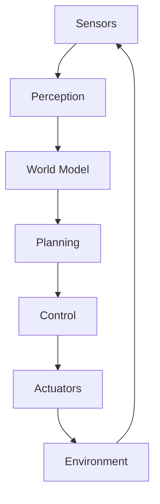

# Introduction to Physical AI

<div className="chapter-meta">
  <div className="chapter-meta-item">
    <strong>Week:</strong> 1-2
  </div>
  <div className="chapter-meta-item">
    <strong>Duration:</strong> ~4 hours
  </div>
  <div className="chapter-meta-item">
    <strong>Level:</strong> Beginner
  </div>
</div>

## Learning Objectives

<div className="learning-objectives">

By the end of this chapter, you will be able to:

- Define Physical AI and explain how it differs from traditional software-based AI
- Understand the key components of an embodied intelligent system
- Identify the major challenges in Physical AI research and development
- Describe the current state of humanoid robotics and future directions
- Set up your development environment for Physical AI projects

</div>

## What is Physical AI?

**Physical AI** refers to artificial intelligence systems that interact with the physical world through embodied agents—robots, drones, autonomous vehicles, and other machines that can sense, reason, and act in real environments.

Unlike traditional AI that operates purely in the digital realm (processing text, images, or data), Physical AI must:

1. **Perceive** the environment through sensors (cameras, LiDAR, touch sensors)
2. **Reason** about spatial relationships, physics, and dynamics
3. **Plan** actions that achieve goals while avoiding obstacles
4. **Act** through actuators (motors, grippers, wheels)
5. **Adapt** to unexpected situations in real-time

### The Embodiment Hypothesis

A fundamental concept in Physical AI is the **Embodiment Hypothesis**, which suggests that intelligence emerges from the interaction between an agent's body, brain, and environment. This means:

> "Intelligence requires a body. True understanding comes from physical interaction with the world."

This challenges the traditional view that intelligence is purely computational and can be achieved without physical grounding.

## The Rise of Humanoid Robots

Recent years have seen remarkable progress in humanoid robotics:

| Company | Robot | Key Features |
|---------|-------|--------------|
| Boston Dynamics | Atlas | Dynamic movement, parkour |
| Tesla | Optimus | General-purpose tasks |
| Figure | Figure 01 | Human-like manipulation |
| 1X Technologies | NEO | Home assistance |
| Agility Robotics | Digit | Warehouse logistics |

### Why Humanoids?

Humanoid robots are designed to work in human environments:

- **Infrastructure Compatibility**: Uses existing tools, vehicles, and spaces
- **Intuitive Interaction**: Natural for humans to work alongside
- **Versatility**: Can perform a wide range of tasks
- **Learning from Humans**: Can learn from human demonstrations

## Core Components of Physical AI Systems

A complete Physical AI system integrates multiple components:



### 1. Perception Stack

Transforms raw sensor data into meaningful representations:

- **Computer Vision**: Object detection, segmentation, pose estimation
- **Depth Sensing**: 3D reconstruction, obstacle detection
- **Proprioception**: Joint positions, velocities, forces
- **Contact Sensing**: Touch, slip, pressure

### 2. World Modeling

Maintains an internal representation of the environment:

- **Geometric Models**: 3D maps, occupancy grids
- **Semantic Models**: Object categories, relationships
- **Dynamic Models**: Motion prediction, physics simulation

### 3. Planning & Decision Making

Determines what actions to take:

- **Task Planning**: High-level goal decomposition
- **Motion Planning**: Collision-free trajectories
- **Manipulation Planning**: Grasp and manipulation strategies

### 4. Control Systems

Executes planned actions:

- **Feedback Control**: PID, model predictive control
- **Whole-Body Control**: Coordinating all joints
- **Compliant Control**: Safe interaction with environment

## The AI Stack for Robotics

Modern Physical AI leverages the full spectrum of AI techniques:

```python
# Example: Vision-Language-Action (VLA) Pipeline
class PhysicalAIAgent:
    def __init__(self):
        self.vision_model = VisionEncoder()      # See
        self.language_model = LanguageModel()    # Understand
        self.action_model = ActionDecoder()      # Act

    def process(self, image, instruction):
        # Encode visual observation
        visual_features = self.vision_model(image)

        # Understand instruction in context
        context = self.language_model(instruction, visual_features)

        # Generate action
        action = self.action_model(context)

        return action
```

### Key AI Technologies

| Technology | Role in Physical AI |
|------------|---------------------|
| Foundation Models | General visual and language understanding |
| Reinforcement Learning | Learning through trial and error |
| Imitation Learning | Learning from human demonstrations |
| Simulation | Safe training environment |
| Transformers | Sequence modeling for actions |

## Challenges in Physical AI

### 1. The Reality Gap

Models trained in simulation often fail in the real world due to:

- Imperfect physics simulation
- Sensor noise and calibration differences
- Unexpected objects and scenarios

**Solution**: Domain randomization, sim-to-real transfer, real-world fine-tuning

### 2. Sample Efficiency

Real-world robots can not train for millions of episodes like game-playing AI:

- Hardware wears out
- Training time is expensive
- Safety constraints limit exploration

**Solution**: Simulation pre-training, few-shot learning, demonstration learning

### 3. Safety and Robustness

Physical AI systems must be:

- Safe around humans
- Robust to sensor failures
- Predictable in edge cases

**Solution**: Formal verification, redundant systems, conservative policies

### 4. Generalization

Robots need to handle novel objects and situations:

- New objects not seen in training
- Different environments
- Unexpected human behaviors

**Solution**: Foundation models, compositional learning, continual learning

## Course Roadmap

This textbook will guide you through building Physical AI systems:

| Week | Topic | Key Skills |
|------|-------|------------|
| 1-2 | Introduction & Setup | Environment configuration |
| 3-5 | ROS 2 Fundamentals | Robot middleware, nodes, topics |
| 6-7 | Digital Twin Simulation | Gazebo, Unity simulation |
| 8-10 | NVIDIA Isaac Sim | GPU simulation, synthetic data |
| 11-13 | Vision-Language-Action | Multimodal AI, policies |
| 13 | Capstone Project | End-to-end system |

## Summary

Physical AI represents the frontier of artificial intelligence—systems that can perceive, reason, and act in the real world. The field combines:

- **Robotics**: Mechanical systems and control
- **Computer Vision**: Visual perception
- **Natural Language Processing**: Human-robot communication
- **Machine Learning**: Adaptive behavior
- **Simulation**: Safe development and training

In the next chapter, we will set up your development environment and introduce the tools you will use throughout this course.

## Further Reading

- Pfeifer, R., & Bongard, J. (2006). *How the Body Shapes the Way We Think*
- Brooks, R. (1991). "Intelligence without representation"
- OpenAI. (2023). "Learning Dexterous In-Hand Manipulation"
- Google DeepMind. (2024). "RT-2: Vision-Language-Action Models"

## Exercises

1. **Conceptual**: Explain why embodiment might be important for AI. Give three examples where physical interaction could help a robot understand concepts.

2. **Research**: Choose one humanoid robot company and write a 500-word summary of their approach to Physical AI.

3. **Discussion**: What ethical considerations should guide the development of Physical AI systems?
