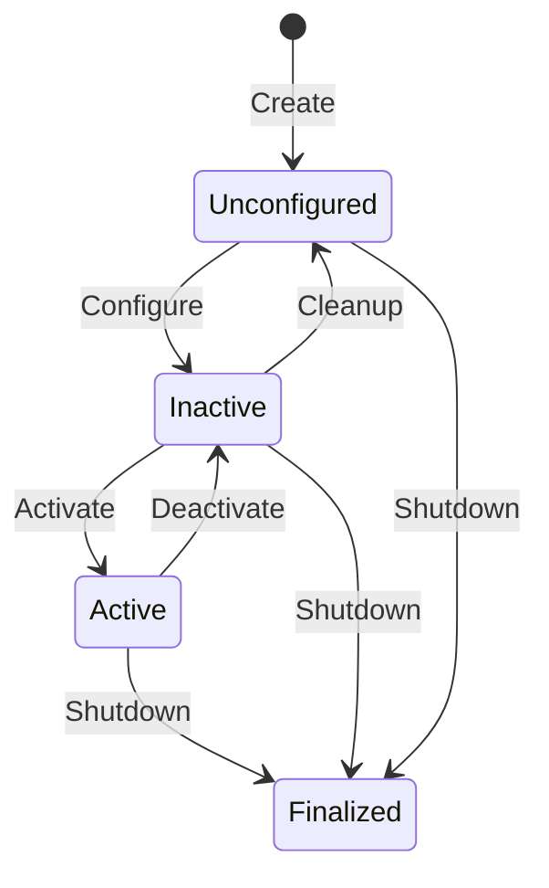

# Nodes and Topics

<div className="chapter-meta">
  <div className="chapter-meta-item">
    <strong>Week:</strong> 3-5
  </div>
  <div className="chapter-meta-item">
    <strong>Duration:</strong> ~4 hours
  </div>
  <div className="chapter-meta-item">
    <strong>Level:</strong> Intermediate
  </div>
</div>

## Learning Objectives

<div className="learning-objectives">

By the end of this chapter, you will be able to:

- Create ROS 2 nodes using Python and the rclpy library
- Implement publishers and subscribers for topic communication
- Use standard message types and create custom messages
- Debug node communication using CLI tools
- Apply best practices for node design and topic naming

</div>

## Understanding Nodes

### Node Lifecycle

ROS 2 nodes follow a defined lifecycle:



### Creating a Basic Node

```python
#!/usr/bin/env python3
"""A complete ROS 2 node example."""

import rclpy
from rclpy.node import Node
from rclpy.parameter import Parameter


class MyRobotNode(Node):
    """Example node demonstrating core ROS 2 patterns."""

    def __init__(self):
        super().__init__('my_robot_node')

        # Declare parameters with defaults
        self.declare_parameter('update_rate', 10.0)
        self.declare_parameter('robot_name', 'robot_1')

        # Get parameter values
        self.update_rate = self.get_parameter('update_rate').value
        self.robot_name = self.get_parameter('robot_name').value

        # Create a timer for periodic execution
        timer_period = 1.0 / self.update_rate
        self.timer = self.create_timer(timer_period, self.timer_callback)

        # Initialize state
        self.counter = 0

        self.get_logger().info(
            f'{self.robot_name} initialized at {self.update_rate} Hz'
        )

    def timer_callback(self):
        """Called periodically by the timer."""
        self.counter += 1
        self.get_logger().debug(f'Timer callback #{self.counter}')


def main(args=None):
    """Entry point for the node."""
    rclpy.init(args=args)

    node = MyRobotNode()

    try:
        rclpy.spin(node)
    except KeyboardInterrupt:
        pass
    finally:
        node.destroy_node()
        rclpy.shutdown()


if __name__ == '__main__':
    main()
```

### Node Parameters

Parameters allow runtime configuration:

```python
class ConfigurableNode(Node):
    def __init__(self):
        super().__init__('configurable_node')

        # Declare multiple parameters
        self.declare_parameters(
            namespace='',
            parameters=[
                ('sensor.enabled', True),
                ('sensor.rate_hz', 30.0),
                ('sensor.frame_id', 'base_link'),
                ('control.kp', 1.0),
                ('control.ki', 0.1),
                ('control.kd', 0.01),
            ]
        )

        # Add parameter callback for dynamic updates
        self.add_on_set_parameters_callback(self.parameter_callback)

    def parameter_callback(self, params):
        """Handle parameter changes at runtime."""
        for param in params:
            self.get_logger().info(
                f'Parameter {param.name} changed to {param.value}'
            )

            if param.name == 'control.kp':
                self.update_controller(kp=param.value)

        return SetParametersResult(successful=True)
```

## Topic Communication

### Publisher Implementation

```python
from std_msgs.msg import Float64
from geometry_msgs.msg import Twist, Vector3

class VelocityPublisher(Node):
    """Publishes velocity commands."""

    def __init__(self):
        super().__init__('velocity_publisher')

        # Create publisher with QoS depth of 10
        self.velocity_pub = self.create_publisher(
            Twist,
            'cmd_vel',
            10
        )

        # Create timer for periodic publishing
        self.timer = self.create_timer(0.1, self.publish_velocity)

        # State
        self.linear_speed = 0.5
        self.angular_speed = 0.0

    def publish_velocity(self):
        """Publish current velocity command."""
        msg = Twist()
        msg.linear = Vector3(x=self.linear_speed, y=0.0, z=0.0)
        msg.angular = Vector3(x=0.0, y=0.0, z=self.angular_speed)

        self.velocity_pub.publish(msg)


### Subscriber Implementation

```python
from nav_msgs.msg import Odometry
from tf_transformations import euler_from_quaternion

class OdometrySubscriber(Node):
    """Subscribes to odometry data."""

    def __init__(self):
        super().__init__('odometry_subscriber')

        self.subscription = self.create_subscription(
            Odometry,
            'odom',
            self.odom_callback,
            10
        )

        # Store latest pose
        self.x = 0.0
        self.y = 0.0
        self.theta = 0.0

    def odom_callback(self, msg: Odometry):
        """Process incoming odometry message."""
        # Extract position
        self.x = msg.pose.pose.position.x
        self.y = msg.pose.pose.position.y

        # Extract orientation (quaternion to euler)
        orientation = msg.pose.pose.orientation
        _, _, self.theta = euler_from_quaternion([
            orientation.x,
            orientation.y,
            orientation.z,
            orientation.w
        ])

        self.get_logger().info(
            f'Position: ({self.x:.2f}, {self.y:.2f}), '
            f'Heading: {self.theta:.2f} rad'
        )
```

### Combined Publisher-Subscriber Node

```python
from sensor_msgs.msg import LaserScan
from geometry_msgs.msg import Twist

class ObstacleAvoider(Node):
    """Simple obstacle avoidance using laser scan data."""

    def __init__(self):
        super().__init__('obstacle_avoider')

        # Subscribe to laser scan
        self.scan_sub = self.create_subscription(
            LaserScan,
            'scan',
            self.scan_callback,
            10
        )

        # Publish velocity commands
        self.cmd_pub = self.create_publisher(Twist, 'cmd_vel', 10)

        # Parameters
        self.declare_parameter('min_distance', 0.5)
        self.declare_parameter('forward_speed', 0.3)
        self.declare_parameter('turn_speed', 0.5)

    def scan_callback(self, msg: LaserScan):
        """Process laser scan and generate velocity command."""
        min_distance = self.get_parameter('min_distance').value
        forward_speed = self.get_parameter('forward_speed').value
        turn_speed = self.get_parameter('turn_speed').value

        # Find minimum distance in front of robot
        # Assuming front is at index len(ranges)//2
        front_ranges = msg.ranges[len(msg.ranges)//4:3*len(msg.ranges)//4]
        valid_ranges = [r for r in front_ranges if msg.range_min < r < msg.range_max]

        if not valid_ranges:
            return

        min_front = min(valid_ranges)

        cmd = Twist()

        if min_front < min_distance:
            # Obstacle detected - turn
            cmd.linear.x = 0.0
            cmd.angular.z = turn_speed
            self.get_logger().warn(f'Obstacle at {min_front:.2f}m - turning')
        else:
            # Clear path - go forward
            cmd.linear.x = forward_speed
            cmd.angular.z = 0.0

        self.cmd_pub.publish(cmd)
```

## Message Types

### Standard Message Types

ROS 2 provides many standard message types:

| Package | Type | Description |
|---------|------|-------------|
| `std_msgs` | `Bool`, `Int32`, `Float64`, `String` | Primitives |
| `geometry_msgs` | `Point`, `Pose`, `Twist`, `Transform` | Geometry |
| `sensor_msgs` | `Image`, `LaserScan`, `PointCloud2`, `Imu` | Sensors |
| `nav_msgs` | `Odometry`, `Path`, `OccupancyGrid` | Navigation |

### Creating Custom Messages

Create a new message type in your package:

**1. Create message file** `msg/RobotStatus.msg`:

```text
# Robot status message
std_msgs/Header header

# State
string state           # idle, moving, error
float64 battery_level  # 0.0 to 1.0

# Position
float64 x
float64 y
float64 theta

# Diagnostics
bool motors_ok
bool sensors_ok
string[] active_tasks
```

**2. Update `package.xml`**:

```xml
<build_depend>rosidl_default_generators</build_depend>
<exec_depend>rosidl_default_runtime</exec_depend>
<member_of_group>rosidl_interface_packages</member_of_group>
```

**3. Update `CMakeLists.txt`** (for ament_cmake) or `setup.py`

**4. Use the custom message**:

```python
from my_package.msg import RobotStatus

msg = RobotStatus()
msg.state = 'moving'
msg.battery_level = 0.85
msg.x = 1.5
msg.y = 2.3
msg.theta = 0.785
msg.motors_ok = True
msg.sensors_ok = True
msg.active_tasks = ['navigate', 'map']
```

## Debugging Topics

### Command-Line Tools

```bash
# List all topics
ros2 topic list

# Show topic info (type, publishers, subscribers)
ros2 topic info /cmd_vel

# Echo messages (Ctrl+C to stop)
ros2 topic echo /odom

# Echo with message type
ros2 topic echo /camera/image_raw sensor_msgs/msg/Image

# Check publishing rate
ros2 topic hz /scan

# Check bandwidth
ros2 topic bw /camera/image_raw

# Publish test message
ros2 topic pub /cmd_vel geometry_msgs/Twist \
  "{linear: {x: 0.5}, angular: {z: 0.1}}"
```

### RQT Graph Visualization

```bash
# View node/topic graph
ros2 run rqt_graph rqt_graph
```

## Best Practices

### Topic Naming Conventions

```text
Good:
  /robot_1/cmd_vel          # Namespaced by robot
  /camera/image_raw         # Sensor namespace
  /navigation/goal          # Function namespace

Bad:
  /vel                      # Too short, ambiguous
  /MyRobotVelocityCommand   # CamelCase (use snake_case)
  /data                     # Not descriptive
```

### Node Design Patterns

1. **Single Responsibility**: One node, one function
2. **Configurable**: Use parameters, not hardcoded values
3. **Resilient**: Handle missing topics gracefully
4. **Observable**: Log meaningful information

```python
class WellDesignedNode(Node):
    def __init__(self):
        super().__init__('well_designed_node')

        # All configuration via parameters
        self.declare_parameters(...)

        # Clear separation of concerns
        self._setup_publishers()
        self._setup_subscribers()
        self._setup_timers()

    def _setup_publishers(self):
        """Initialize all publishers."""
        self.status_pub = self.create_publisher(...)

    def _setup_subscribers(self):
        """Initialize all subscribers."""
        self.sensor_sub = self.create_subscription(...)

    def _setup_timers(self):
        """Initialize all timers."""
        self.update_timer = self.create_timer(...)
```

## Summary

- **Nodes** are the fundamental building blocks of ROS 2 applications
- **Topics** enable publish-subscribe communication between nodes
- **Parameters** allow runtime configuration of nodes
- **Message types** define the structure of communicated data
- Following best practices ensures maintainable, reusable code

## Exercises

1. **Publisher**: Create a node that publishes random `geometry_msgs/Point` messages at 1 Hz.

2. **Subscriber**: Create a node that subscribes to the point topic and calculates the distance from the origin.

3. **Integration**: Combine your publisher and subscriber with a third node that only logs points farther than 5 units from the origin.

4. **Custom Message**: Create a custom message for a robot's sensor readings (temperature, voltage, status).
