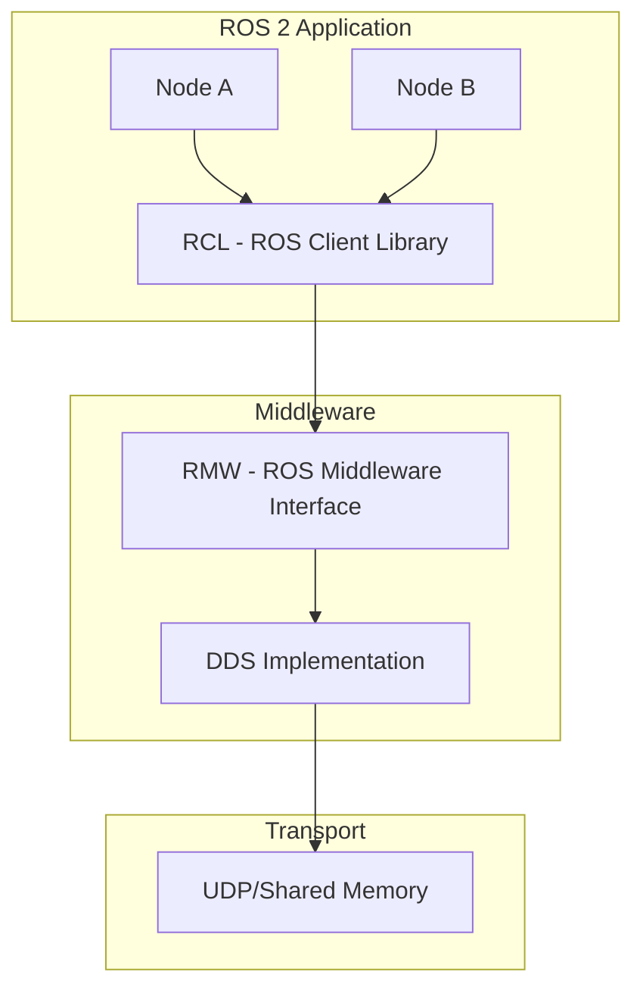

# ROS 2 Overview

<div className="chapter-meta">
  <div className="chapter-meta-item">
    <strong>Week:</strong> 3-5
  </div>
  <div className="chapter-meta-item">
    <strong>Duration:</strong> ~3 hours
  </div>
  <div className="chapter-meta-item">
    <strong>Level:</strong> Beginner
  </div>
</div>

## Learning Objectives

<div className="learning-objectives">

By the end of this chapter, you will be able to:

- Explain what ROS 2 is and why it's essential for robotics
- Understand the key architectural differences between ROS 1 and ROS 2
- Describe the core concepts: nodes, topics, services, and actions
- Navigate the ROS 2 ecosystem and find packages
- Set up and build a ROS 2 workspace

</div>

## Prerequisites

<div className="prerequisites">

Before starting this chapter, ensure you have:

- Completed the [Development Environment Setup](/docs/week-01-02-intro/setup)
- ROS 2 Humble installed and configured
- Basic Python programming knowledge
- Familiarity with command-line interfaces

</div>

## What is ROS 2?

**ROS 2** (Robot Operating System 2) is an open-source robotics middleware that provides:

- **Communication Infrastructure**: Standardized ways for robot components to talk to each other
- **Hardware Abstraction**: Interfaces to sensors, actuators, and controllers
- **Development Tools**: Visualization, debugging, and simulation tools
- **Ecosystem**: Thousands of packages for perception, planning, and control

:::note
Despite its name, ROS 2 is not an operating system. It's a middleware framework that runs on top of standard operating systems like Ubuntu.
:::

### Why ROS 2 for Physical AI?

| Feature | Benefit for Physical AI |
|---------|------------------------|
| **Real-time Support** | Deterministic timing for control loops |
| **Security** | Encrypted communication for production |
| **Multi-robot** | Native support for robot fleets |
| **Cross-platform** | Linux, Windows, macOS, embedded |
| **DDS Foundation** | Industrial-grade communication |

## ROS 2 Architecture

### Communication Layer: DDS

ROS 2 is built on **Data Distribution Service (DDS)**, an industry-standard middleware:



### Key Benefits of DDS

1. **Discovery**: Nodes automatically find each other
2. **Quality of Service (QoS)**: Configure reliability, durability, deadlines
3. **Security**: Built-in authentication and encryption
4. **Scalability**: Supports single robot to large fleets

## Core Concepts

### 1. Nodes

A **node** is a single-purpose process in the ROS 2 graph:

```python
import rclpy
from rclpy.node import Node

class MinimalNode(Node):
    def __init__(self):
        super().__init__('minimal_node')
        self.get_logger().info('Hello from ROS 2!')

def main():
    rclpy.init()
    node = MinimalNode()
    rclpy.spin(node)
    rclpy.shutdown()

if __name__ == '__main__':
    main()
```

**Best Practices for Nodes:**
- One node per logical function (e.g., camera driver, object detector)
- Use descriptive names (`lidar_processor`, `arm_controller`)
- Keep nodes modular and reusable

### 2. Topics

**Topics** enable publish-subscribe communication:

```python
# Publisher
from std_msgs.msg import String

class Publisher(Node):
    def __init__(self):
        super().__init__('publisher')
        self.pub = self.create_publisher(String, 'chatter', 10)
        self.timer = self.create_timer(1.0, self.timer_callback)

    def timer_callback(self):
        msg = String()
        msg.data = 'Hello World'
        self.pub.publish(msg)

# Subscriber
class Subscriber(Node):
    def __init__(self):
        super().__init__('subscriber')
        self.sub = self.create_subscription(
            String, 'chatter', self.callback, 10)

    def callback(self, msg):
        self.get_logger().info(f'Received: {msg.data}')
```

**When to Use Topics:**
- Streaming data (sensor readings, camera images)
- One-to-many communication
- Asynchronous data flow

### 3. Services

**Services** provide request-response communication:

```python
from example_interfaces.srv import AddTwoInts

class AddService(Node):
    def __init__(self):
        super().__init__('add_service')
        self.srv = self.create_service(
            AddTwoInts, 'add_two_ints', self.callback)

    def callback(self, request, response):
        response.sum = request.a + request.b
        return response

# Client
class AddClient(Node):
    def __init__(self):
        super().__init__('add_client')
        self.client = self.create_client(AddTwoInts, 'add_two_ints')

    async def call_service(self, a, b):
        request = AddTwoInts.Request()
        request.a = a
        request.b = b
        future = self.client.call_async(request)
        return await future
```

**When to Use Services:**
- Configuration changes
- One-time queries
- Synchronous operations

### 4. Actions

**Actions** handle long-running tasks with feedback:

```python
from action_tutorials_interfaces.action import Fibonacci
from rclpy.action import ActionServer

class FibonacciServer(Node):
    def __init__(self):
        super().__init__('fibonacci_server')
        self._action_server = ActionServer(
            self, Fibonacci, 'fibonacci',
            self.execute_callback)

    async def execute_callback(self, goal_handle):
        feedback = Fibonacci.Feedback()
        sequence = [0, 1]

        for i in range(goal_handle.request.order):
            sequence.append(sequence[-1] + sequence[-2])
            feedback.partial_sequence = sequence
            goal_handle.publish_feedback(feedback)

        goal_handle.succeed()
        result = Fibonacci.Result()
        result.sequence = sequence
        return result
```

**When to Use Actions:**
- Long-running tasks (navigation, manipulation)
- Tasks that need feedback (progress updates)
- Preemptable operations (cancellation support)

## ROS 2 Command-Line Tools

### Essential Commands

```bash
# List running nodes
ros2 node list

# Get info about a node
ros2 node info /my_node

# List topics
ros2 topic list

# Echo topic messages
ros2 topic echo /chatter

# Publish to a topic
ros2 topic pub /chatter std_msgs/String "data: 'hello'"

# List services
ros2 service list

# Call a service
ros2 service call /add_two_ints example_interfaces/srv/AddTwoInts "{a: 1, b: 2}"

# List parameters
ros2 param list

# Get/set parameters
ros2 param get /node_name param_name
ros2 param set /node_name param_name value
```

### Visualization Tools

```bash
# Launch RViz for visualization
ros2 run rviz2 rviz2

# View computation graph
ros2 run rqt_graph rqt_graph

# Monitor topic rates
ros2 topic hz /camera/image
```

## ROS 2 Workspace Structure

A typical ROS 2 workspace:

```text
ros2_ws/
├── src/
│   ├── my_package/
│   │   ├── my_package/
│   │   │   ├── __init__.py
│   │   │   └── my_node.py
│   │   ├── resource/
│   │   ├── test/
│   │   ├── package.xml
│   │   └── setup.py
│   └── another_package/
├── build/          # Build artifacts
├── install/        # Installed packages
└── log/            # Build logs
```

### Creating a Package

```bash
cd ~/ros2_ws/src

# Python package
ros2 pkg create --build-type ament_python my_py_package

# C++ package
ros2 pkg create --build-type ament_cmake my_cpp_package

# Build workspace
cd ~/ros2_ws
colcon build

# Source workspace
source install/setup.bash
```

## Quality of Service (QoS)

QoS profiles control communication behavior:

```python
from rclpy.qos import QoSProfile, ReliabilityPolicy, HistoryPolicy

# Reliable delivery (like TCP)
reliable_qos = QoSProfile(
    reliability=ReliabilityPolicy.RELIABLE,
    history=HistoryPolicy.KEEP_LAST,
    depth=10
)

# Best effort (like UDP)
sensor_qos = QoSProfile(
    reliability=ReliabilityPolicy.BEST_EFFORT,
    history=HistoryPolicy.KEEP_LAST,
    depth=1
)

# Use in publisher/subscriber
self.pub = self.create_publisher(Image, 'camera', sensor_qos)
```

### Common QoS Profiles

| Profile | Use Case |
|---------|----------|
| `SENSOR_DATA` | Camera, LiDAR (latest data matters) |
| `PARAMETERS` | Configuration (reliable, transient) |
| `SERVICES` | Request/response (reliable) |
| `SYSTEM_DEFAULT` | General purpose |

## Summary

ROS 2 provides the foundation for Physical AI systems:

- **Nodes**: Modular, single-purpose processes
- **Topics**: Publish-subscribe for streaming data
- **Services**: Request-response for queries
- **Actions**: Long-running tasks with feedback
- **QoS**: Fine-grained communication control

In the next chapter, we will dive deeper into nodes and topics, building practical robot applications.

## Exercises

1. **Exploration**: Use `ros2 node list` and `ros2 topic list` to explore a running turtlesim.

2. **CLI Practice**: Publish velocity commands to `/turtle1/cmd_vel` using `ros2 topic pub`.

3. **Code**: Create a node that subscribes to `/turtle1/pose` and prints the turtle's position.
