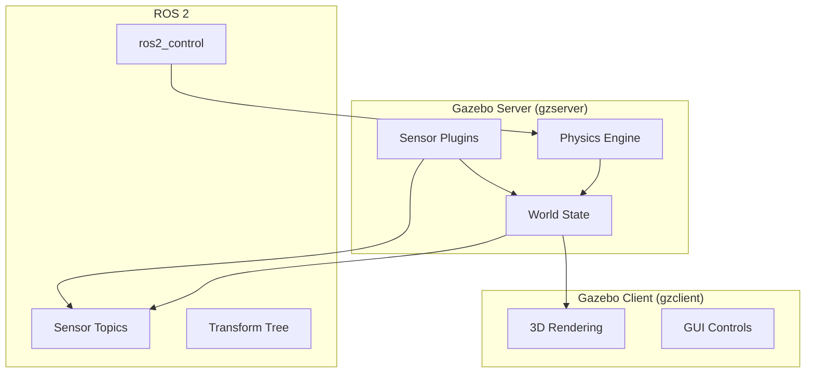

# Introduction to Gazebo

<div className="chapter-meta">
  <div className="chapter-meta-item">
    <strong>Week:</strong> 6-7
  </div>
  <div className="chapter-meta-item">
    <strong>Duration:</strong> ~4 hours
  </div>
  <div className="chapter-meta-item">
    <strong>Level:</strong> Intermediate
  </div>
</div>

## Learning Objectives

<div className="learning-objectives">

By the end of this chapter, you will be able to:

- Understand the role of simulation in robotics development
- Set up and configure Gazebo simulation environments
- Import robot models (URDF) into Gazebo
- Create custom simulation worlds with objects and terrain
- Interface Gazebo with ROS 2 for sensor data and control

</div>

## Why Simulation?

Simulation is essential for Physical AI development:

| Benefit | Description |
|---------|-------------|
| **Safety** | Test dangerous scenarios without real hardware |
| **Speed** | Run thousands of experiments in parallel |
| **Cost** | No wear and tear on expensive robots |
| **Reproducibility** | Exact same conditions every time |
| **Data Generation** | Create synthetic training data |

## Gazebo Overview

**Gazebo** is an open-source robotics simulator that provides:

- **Physics Engine**: ODE, Bullet, DART, or Simbody
- **Sensor Simulation**: Cameras, LiDAR, IMU, GPS
- **Environment Modeling**: Terrain, objects, lighting
- **ROS Integration**: Native ROS 2 support

### Gazebo Architecture



## Getting Started

### Launching Gazebo

```bash
# Empty world
gazebo

# With ROS 2 integration
ros2 launch gazebo_ros gazebo.launch.py

# Custom world
ros2 launch gazebo_ros gazebo.launch.py world:=/path/to/world.sdf
```

### Spawning a Robot

```bash
# Spawn robot from URDF
ros2 run gazebo_ros spawn_entity.py \
    -topic robot_description \
    -entity my_robot

# Spawn at specific position
ros2 run gazebo_ros spawn_entity.py \
    -topic robot_description \
    -entity my_robot \
    -x 1.0 -y 2.0 -z 0.5
```

## Creating Worlds

### Basic World File (SDF)

```xml
<?xml version="1.0"?>
<sdf version="1.6">
  <world name="my_world">
    <!-- Ground plane -->
    <include>
      <uri>model://ground_plane</uri>
    </include>

    <!-- Sun light -->
    <include>
      <uri>model://sun</uri>
    </include>

    <!-- Custom object -->
    <model name="box">
      <pose>2 0 0.5 0 0 0</pose>
      <link name="link">
        <collision name="collision">
          <geometry>
            <box><size>1 1 1</size></box>
          </geometry>
        </collision>
        <visual name="visual">
          <geometry>
            <box><size>1 1 1</size></box>
          </geometry>
          <material>
            <ambient>0.8 0.2 0.2 1</ambient>
          </material>
        </visual>
      </link>
    </model>

    <!-- Physics settings -->
    <physics type="ode">
      <max_step_size>0.001</max_step_size>
      <real_time_factor>1</real_time_factor>
    </physics>
  </world>
</sdf>
```

## ROS 2 Integration

### Gazebo Plugins

Common plugins for ROS 2 integration:

```xml
<!-- Differential drive controller -->
<plugin name="diff_drive" filename="libgazebo_ros_diff_drive.so">
  <ros>
    <namespace>/my_robot</namespace>
  </ros>
  <left_joint>left_wheel_joint</left_joint>
  <right_joint>right_wheel_joint</right_joint>
  <wheel_separation>0.4</wheel_separation>
  <wheel_diameter>0.2</wheel_diameter>
  <command_topic>cmd_vel</command_topic>
  <odometry_topic>odom</odometry_topic>
  <publish_odom>true</publish_odom>
  <publish_odom_tf>true</publish_odom_tf>
</plugin>
```

### Launch File Example

```python
from launch import LaunchDescription
from launch.actions import IncludeLaunchDescription
from launch.launch_description_sources import PythonLaunchDescriptionSource
from launch_ros.actions import Node
from ament_index_python.packages import get_package_share_directory
import os

def generate_launch_description():
    pkg_gazebo_ros = get_package_share_directory('gazebo_ros')
    pkg_my_robot = get_package_share_directory('my_robot')

    world_path = os.path.join(pkg_my_robot, 'worlds', 'my_world.sdf')

    gazebo = IncludeLaunchDescription(
        PythonLaunchDescriptionSource(
            os.path.join(pkg_gazebo_ros, 'launch', 'gazebo.launch.py')
        ),
        launch_arguments={'world': world_path}.items()
    )

    spawn_robot = Node(
        package='gazebo_ros',
        executable='spawn_entity.py',
        arguments=['-topic', 'robot_description', '-entity', 'my_robot'],
        output='screen'
    )

    return LaunchDescription([
        gazebo,
        spawn_robot,
    ])
```

## Summary

Gazebo provides a powerful simulation environment for:

- Testing robot behavior safely
- Developing perception and control algorithms
- Generating synthetic training data
- Validating designs before hardware builds

In the next chapter, we explore Unity as an alternative simulation platform.

## Exercises

1. **World Creation**: Create a Gazebo world with multiple obstacles arranged as a maze.

2. **Robot Spawn**: Spawn a TurtleBot3 robot and control it via teleop.

3. **Sensor Test**: Add a camera to your robot and visualize the image in RViz.

4. **Custom Plugin**: Write a simple Gazebo plugin that logs collision events.
