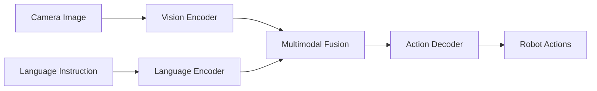

# Vision-Language-Action Systems Overview

<div className="chapter-meta">
  <div className="chapter-meta-item">
    <strong>Week:</strong> 11-13
  </div>
  <div className="chapter-meta-item">
    <strong>Duration:</strong> ~4 hours
  </div>
  <div className="chapter-meta-item">
    <strong>Level:</strong> Advanced
  </div>
</div>

## Learning Objectives

<div className="learning-objectives">

By the end of this chapter, you will be able to:

- Understand the VLA paradigm for robotic control
- Explain how vision, language, and action are integrated
- Identify key VLA architectures (RT-1, RT-2, PaLM-E)
- Understand the training data requirements for VLA systems
- Describe the challenges and future directions of VLA

</div>

## What are VLA Systems?

**Vision-Language-Action (VLA)** systems are multimodal AI models that:

1. **See**: Process visual input from cameras
2. **Understand**: Interpret natural language instructions
3. **Act**: Generate robot actions or control commands



## The Evolution of Robot Learning

| Generation | Approach | Example |
|------------|----------|---------|
| **Classical** | Hand-coded rules | Industrial arms |
| **Learned** | Task-specific ML | DQN for games |
| **Foundation** | Large pretrained models | CLIP, GPT |
| **VLA** | Unified vision-language-action | RT-2, PaLM-E |

## Key VLA Architectures

### RT-1 (Robotics Transformer 1)

Google's first large-scale robot transformer:

- **Architecture**: Transformer with image tokenization
- **Training**: 130K real robot demonstrations
- **Output**: Discretized action tokens
- **Capability**: 700+ tasks, 97% success rate

```python
# Conceptual RT-1 inference
class RT1:
    def __init__(self):
        self.vision_encoder = EfficientNet()
        self.transformer = TransformerDecoder()
        self.action_head = ActionTokenizer()

    def forward(self, image, instruction):
        # Encode image
        visual_tokens = self.vision_encoder(image)

        # Encode instruction
        text_tokens = self.tokenize(instruction)

        # Fuse and decode
        context = torch.cat([visual_tokens, text_tokens])
        action_tokens = self.transformer(context)

        # Convert to continuous actions
        return self.action_head.decode(action_tokens)
```

### RT-2 (Robotics Transformer 2)

VLM (Vision-Language Model) fine-tuned for robotics:

- **Base**: PaLI-X or PaLM-E (55B parameters)
- **Key Insight**: Actions as text tokens
- **Emergent**: Generalization to unseen objects/tasks

```text
Input:  [Image of table with apple and bowl]
        "Pick up the apple and put it in the bowl"

Output: "1 128 91 241 1 127 17"  # Action tokens
        -> Decoded to: [x, y, z, roll, pitch, yaw, gripper]
```

### PaLM-E (Embodied Language Model)

562B parameter model integrating:

- **Vision**: ViT image encoder
- **Language**: PaLM language model
- **Robotics**: Low-level control integration

## Training VLA Systems

### Data Requirements

| Data Type | Purpose | Scale |
|-----------|---------|-------|
| Robot demonstrations | Action learning | 100K-1M episodes |
| Internet images | Visual understanding | Billions |
| Text corpora | Language understanding | Trillions of tokens |
| Simulation | Safe exploration | Unlimited |

### Training Pipeline

```python
# Simplified VLA training loop
def train_vla(model, dataset):
    for batch in dataset:
        images = batch['images']           # [B, C, H, W]
        instructions = batch['instructions']  # [B, seq_len]
        actions = batch['actions']         # [B, action_dim]

        # Forward pass
        predicted_actions = model(images, instructions)

        # Action prediction loss
        loss = F.mse_loss(predicted_actions, actions)

        # Backprop
        loss.backward()
        optimizer.step()
```

## Challenges

### 1. Data Scarcity
Real robot data is expensive and slow to collect.

**Solutions**:
- Simulation-to-real transfer
- Human video learning
- Teleoperation datasets

### 2. Generalization
Robots must handle novel objects, scenes, and instructions.

**Solutions**:
- Foundation model pretraining
- Domain randomization
- Compositional architectures

### 3. Safety
VLA systems must be safe around humans.

**Solutions**:
- Conservative policies
- Human-in-the-loop
- Formal verification

## Summary

VLA systems represent a paradigm shift in robotics:

- **Unified architecture** for perception, language, and action
- **Foundation model** transfer from internet-scale data
- **Emergent generalization** to unseen scenarios
- **Natural language** interface for human-robot interaction

The field is rapidly evolving with new architectures appearing regularly.

## Further Reading

- Brohan et al. (2023). "RT-2: Vision-Language-Action Models"
- Driess et al. (2023). "PaLM-E: An Embodied Multimodal Language Model"
- Open X-Embodiment Collaboration (2023). "Open X-Embodiment Dataset"

## Exercises

1. **Research**: Compare RT-1, RT-2, and PaLM-E architectures. What are the key differences?

2. **Conceptual**: Design a VLA system for a home robot. What tasks should it handle?

3. **Data Analysis**: Explore the Open X-Embodiment dataset. What robots and tasks are included?

4. **Implementation**: Implement a simple vision-language model using CLIP and a small action head.
