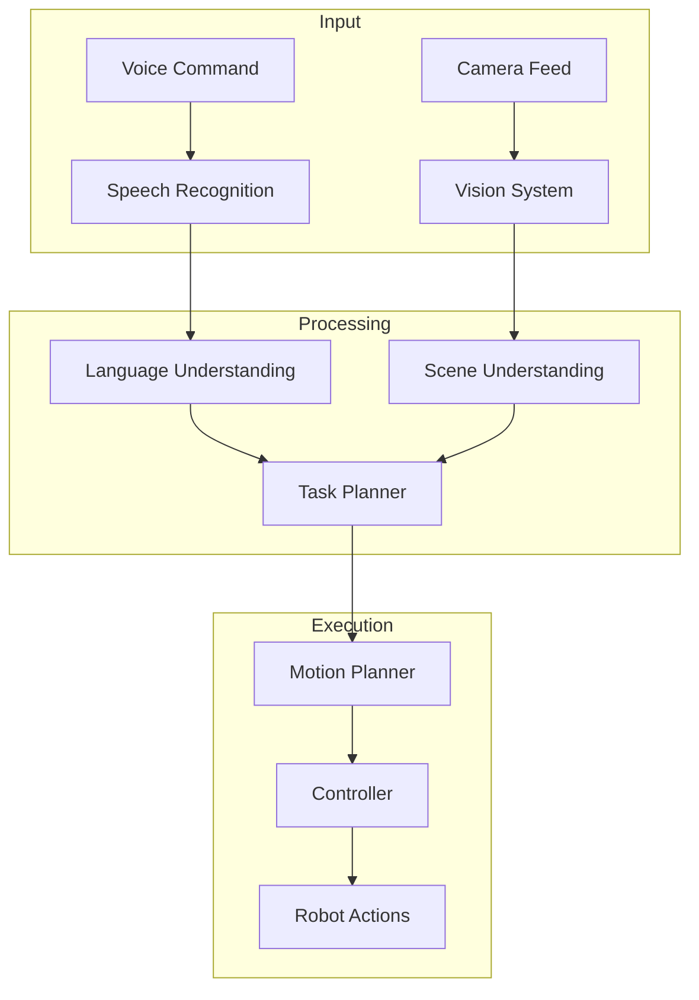

# Capstone Project Overview

<div className="chapter-meta">
  <div className="chapter-meta-item">
    <strong>Week:</strong> 13
  </div>
  <div className="chapter-meta-item">
    <strong>Duration:</strong> ~8 hours
  </div>
  <div className="chapter-meta-item">
    <strong>Level:</strong> Advanced
  </div>
</div>

## Learning Objectives

<div className="learning-objectives">

By the end of this capstone, you will have:

- Built an end-to-end autonomous robot system
- Integrated perception, planning, and control
- Implemented a voice-to-action pipeline
- Tested your system in simulation
- Documented your project professionally

</div>

## Project Overview

The capstone project brings together everything you have learned:



## Project Requirements

### Core Requirements

1. **Voice Interface**
   - Accept natural language commands
   - Parse intent and extract parameters
   - Provide voice feedback

2. **Visual Perception**
   - Object detection and recognition
   - Scene understanding
   - Spatial reasoning

3. **Task Execution**
   - Motion planning
   - Manipulation (pick and place)
   - Navigation

4. **Integration**
   - ROS 2 architecture
   - Simulation testing (Gazebo or Isaac Sim)
   - Error handling and recovery

### Minimum Viable Demo

Your robot must successfully:

1. Receive a voice command: *"Pick up the red cup and place it on the table"*
2. Identify the red cup in the scene
3. Plan and execute a grasp
4. Navigate to the table
5. Place the object
6. Confirm completion verbally

## System Architecture

### Recommended Stack

| Component | Technology |
|-----------|------------|
| Speech Recognition | Whisper, Google STT |
| Language Understanding | Claude API, local LLM |
| Vision | YOLOv8, SAM |
| Planning | MoveIt 2, Nav2 |
| Control | ros2_control |
| Simulation | Gazebo, Isaac Sim |

### ROS 2 Node Structure

```text
/capstone_robot
├── /speech_node           # Voice I/O
├── /language_node         # Intent parsing
├── /perception_node       # Object detection
├── /planning_node         # Task planning
├── /manipulation_node     # Arm control
├── /navigation_node       # Base movement
└── /coordinator_node      # System orchestration
```

## Implementation Phases

### Phase 1: Setup (Day 1)
- Configure ROS 2 workspace
- Set up simulation environment
- Import robot model

### Phase 2: Perception (Day 2)
- Implement camera interface
- Add object detection
- Test detection accuracy

### Phase 3: Planning (Day 3)
- Configure MoveIt 2
- Implement grasp planning
- Test manipulation

### Phase 4: Voice Interface (Day 4)
- Add speech recognition
- Implement command parsing
- Add voice feedback

### Phase 5: Integration (Day 5)
- Connect all nodes
- Implement state machine
- End-to-end testing

### Phase 6: Polish (Day 6)
- Error handling
- Documentation
- Demo video

## Evaluation Criteria

| Criterion | Weight | Description |
|-----------|--------|-------------|
| Functionality | 40% | Does it work? |
| Architecture | 20% | Clean, modular design |
| Documentation | 15% | Clear README, comments |
| Demo | 15% | Professional presentation |
| Innovation | 10% | Creative solutions |

## Deliverables

1. **Code Repository**
   - All source code
   - Launch files
   - Configuration files

2. **Documentation**
   - README with setup instructions
   - Architecture diagram
   - API documentation

3. **Demo Video**
   - 90-second demonstration
   - Voice narration
   - Multiple scenarios

4. **Report**
   - Design decisions
   - Challenges faced
   - Future improvements

## Getting Started

```bash
# Clone starter template
git clone https://github.com/physical-ai/capstone-starter
cd capstone-starter

# Build workspace
colcon build

# Launch simulation
ros2 launch capstone_robot simulation.launch.py

# Run demo
ros2 launch capstone_robot demo.launch.py
```

## Resources

- [MoveIt 2 Documentation](https://moveit.ros.org/)
- [Nav2 Documentation](https://navigation.ros.org/)
- [OpenAI Whisper](https://github.com/openai/whisper)
- [YOLOv8](https://docs.ultralytics.com/)

## Tips for Success

1. **Start simple**: Get basic functionality working first
2. **Test incrementally**: Verify each component before integrating
3. **Use simulation**: Debug in simulation before real hardware
4. **Document as you go**: Don't leave documentation for the end
5. **Ask for help**: Use course forums and office hours

Good luck with your capstone project!
